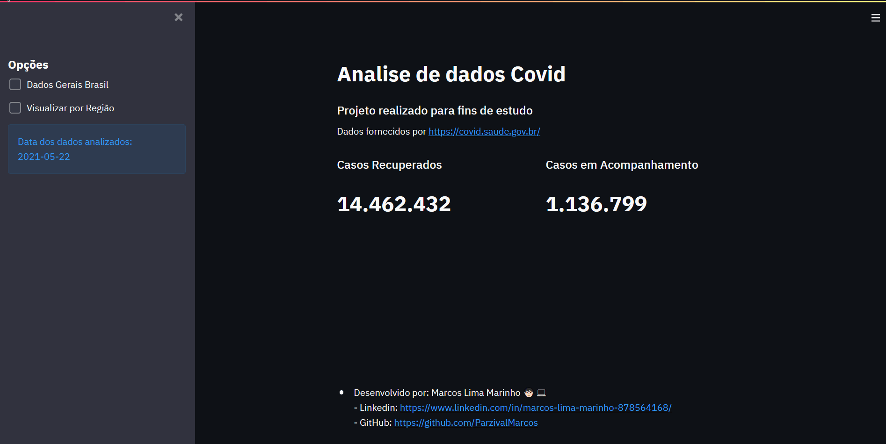

# Analise Dados Covid Brasil
Projeto de analise de dados da Covid, com dados disponibilizados pelo governo. Usando python, pandas e o streamlit para a visualização dos dados
 
#### Visualização dos dados do Basil

 

#### Visualização por região

 

---

#### Instalação
- Versão Python: `3.8.6 64bits`

- Instalação das dependências: `pip install -r requiriments.exe`
 

#### Utilização
- Após instalar as dependências, utilizar o comando: `streamlit run analise.py`
	O servidor do streamlit será inicializado e o navegador será aberto
